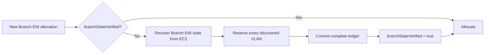

# VPC Resource Controller Restart Recovery and IP Reuse

> Status: Proposed
>
> Primary goal: Issue 634
>
> Related correctness issue: Issue 515 / private-IP reuse

## 1. Scope

This document separates two changes that must not be partially mixed.

| Flow | Owning change |
|---|---|
| Controller restart recovery without IP reuse | Issue 634 |
| IP reuse during restart | Issue 515 |
| IP reuse while the controller is already running | Issue 515 |

Issue 634 does not change CNINode ownership, delete/recreate CNINodes, or
replace a live NodeManager/provider cache. Issue 515 must handle restart and
non-restart IP reuse together so CNINode and in-memory generations transition
under one protocol.

Duplicate-VLAN quarantine and reactive orphan cleanup are not part of either
normal recovery flow.

## 2. Goals

### Issue 634

- Restore stable instance and trunk state without synchronous per-Node EC2
  discovery.
- Do not treat running Pod annotations as a complete Branch ENI/VLAN ledger.
- Before the first new Branch ENI allocation on a restored trunk, recover the
  complete Branch ENI/VLAN state from EC2.
- Never consume a checkpoint belonging to another EC2 instance.
- Reduce custom-networking subnet calls to one call per unique subnet per
  controller process.

## 3. Non-goals

- Changing CNINode owner references in Issue 634.
- Deleting or recreating a CNINode in Issue 634.
- Replacing a stale live NodeManager/provider cache in Issue 634.
- Solving only the restart half of IP reuse.
- Persisting the complete Branch ENI lifecycle in CNINode status.
- Changing duplicate-VLAN cleanup behavior.

## 4. Issue 634 restart recovery

### 4.1 Stable checkpoint

`CNINode.status.nodeNetworkState` stores stable recovery inputs:

- instance ID and type;
- primary subnet and CIDRs;
- primary ENI identity and security groups;
- connection-tracking configuration;
- trunk ENI identity.

On controller restart, NodeManager has an empty in-memory cache:

```text
NodeController
    -> NodeManager.GetNode = cache miss
    -> AddNode
    -> submit Init job
```

The Init job validates:

```text
checkpoint instance ID
    ==
current Kubernetes Node providerID instance ID
```

If they match, Init restores the stable instance and trunk state. If they do not
match, the checkpoint is not consumed.

Checkpoints without the primary ENI identity use the EC2 fallback once and are
rewritten. IP and prefix cleanup never deletes an ENI while that identity is unknown.

### 4.2 Branch-state verification

Running Pod annotations identify Branch ENIs owned by live Pods, but they do not
include ENIs in cooldown, deletion, failed-allocation or orphan states.

After checkpoint-based trunk recovery, the trunk starts with:

```go
branchStateVerified = false
```

Every path that can choose a VLAN or create a Branch ENI must first ensure the
flag is true.



Recovery requirements:

1. Query all controller-managed Branch ENIs for the trunk.
2. Handle pagination.
3. Do not restrict the query to the current subnet.
4. Use Pod annotations to identify Pod-owned ENIs.
5. Reserve the VLAN of every Branch ENI returned by EC2.
6. Commit the complete ledger atomically.
7. Set `branchStateVerified` only after the complete commit succeeds.
8. On any failure, leave the flag false and return a retryable allocation
   error.

Only one recovery operation may run concurrently for a trunk. The first Pod
performs the EC2 query; other Pods wait for the same result.

No additional recovery-specific backoff is introduced. Existing Pod allocation
retry behavior controls subsequent attempts after a failed EC2 query.

### 4.3 Custom networking

The restored checkpoint does not override current ENIConfig.

Current custom-networking subnet CIDRs are resolved through a process-wide
cache. Concurrent misses for the same subnet share one EC2 request.

The expected call count is:

```text
O(unique custom-networking subnets per controller process)
```

instead of:

```text
O(custom-networking Nodes)
```

## 5. Issue 515: IP reuse as one generation transition

Issue 515 owns CNINode freshness and live cache replacement. Its design must
cover both controller states.

### 5.1 Persistent object freshness

When a current Node has the same name as an old Node, the old CNINode cannot be
used as the current Node's dependency.

The Issue 515 protocol must:

1. identify the CNINode generation by owner Node UID;
2. delete an active stale CNINode with a UID precondition;
3. create or reconcile a successor owned by the current Node UID;
4. preserve authoritative desired features;
5. never copy old instance-specific runtime status into the successor.

### 5.2 Restart path

After controller restart, NodeManager and provider caches are empty. Once the
current-owner CNINode exists, the normal `AddNode` path can initialize the
current instance and write fresh status.

### 5.3 Non-restart path

Without controller restart, stale in-memory state may still exist:

```text
Kubernetes Node = current instance
CNINode          = old or deleting generation
NodeManager      = old instance still cached
Provider cache   = old trunk may still be present
```

Issue 515 must define a generation-aware handoff before initializing the
current Node. At minimum:

- a cached instance mismatch must never enter `UpdateNode`;
- the old manager/provider generation must be removed before current `AddNode`;
- asynchronous cleanup must carry the old instance or trunk identity;
- an old cleanup job must no-op if the cache now belongs to a newer generation.

The handoff waits for local ownership of the cache, not for every old EC2
resource to finish deleting.

The exact manager/provider interface belongs in the Issue 515 design and must
be validated with rapid same-name Node replacement tests before merge.

## 6. Change ownership

### Issue 634 owns

- Stable `NodeNetworkState` checkpoint.
- Instance-ID validation at the checkpoint consumption boundary.
- Stable trunk restoration.
- Pod annotations as the source of live Pod ownership.
- Custom-subnet process cache and concurrent lookup coalescing.
- Normal `AddNode` CNINode creation.
- Add `branchStateVerified` to the restored trunk.
- Do not treat Pod annotations as proof of a complete VLAN ledger.
- Recover the complete Branch ENI state from EC2 before the first allocation.
- Block all VLAN selection while the flag is false.
- Remove the current-subnet filter from Branch ENI recovery.

### Issue 515 owns

- NodeController stale-CNINode deletion.
- CNINodeController current-owner replacement.
- Cached Node/provider generation replacement.
- Instance-aware delayed cleanup jobs.

### Neither change owns

- New duplicate-VLAN quarantine/orphan-cleanup behavior added specifically to
  compensate for incomplete restart state.
- New recovery-specific retry/backoff.

## 7. Correctness invariants

### Restart recovery

1. A checkpoint for another instance is never consumed.
2. No VLAN is selected while `branchStateVerified` is false.
3. Every EC2 Branch ENI reserves its VLAN before verification succeeds.
4. Partial recovery never sets the flag.
5. Only one recovery operation runs concurrently per trunk.
6. IP and prefix cleanup never deletes an ENI without a known primary ENI identity.

### Issue 515

1. Stale CNINode deletion uses a UID precondition.
2. The successor belongs to the current Node UID.
3. Old runtime status is not copied.
4. A cached instance-ID mismatch never enters `UpdateNode`.
5. Old asynchronous cleanup cannot mutate the current generation.

## 8. Validation

| Test | Expected result |
|---|---|
| Restart with existing idle Nodes | Stable state restores without per-Node Branch ENI discovery |
| First allocation on a restored trunk | One EC2 recovery, then `branchStateVerified=true` |
| Concurrent allocations on one trunk | One recovery; remaining requests wait |
| EC2 or pagination failure | Flag stays false; no VLAN is allocated |
| Transitional Branch ENI | Its VLAN is reserved before allocation |
| Branch ENI in an old custom subnet | Found because recovery has no subnet filter |

Issue 515 has a separate test matrix covering restart and non-restart
same-name Node replacement, successor creation, cache handoff and delayed-job
fencing.

## 9. Decisions requested

1. Accept Branch-state recovery before the first new allocation instead of
   during every Node restart.
2. Accept one Branch ENI EC2 query per restored trunk that receives a new
   allocation.
3. Keep all CNINode and in-memory generation replacement out of Issue 634.
4. Require Issue 515 to solve restart and non-restart IP reuse together.
