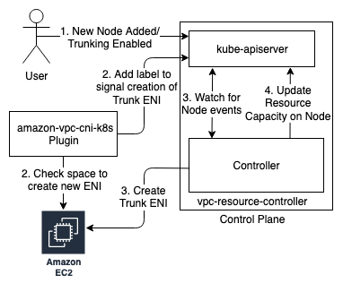
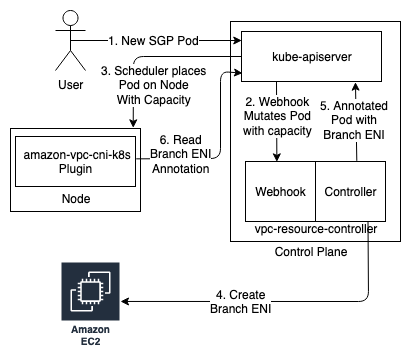

# Security Group for Pods Event Workflows
This document presents high level workflow diagram for Events associated with Nodes and Pods using Security Group for Pods feature.

## Adding a supported Node to Cluster

Security Group for Pods is supported only on Nitro Based Instances.

1. User adds a new supported node or enables ENI Trunking with existing nodes present in the cluster.
2. VPC CNI Plugin updates EKS-managed CRD `CNINode <NODE-NAME>` to add feature `SecurityGroupsForPods` if the node has capacity to create 1 additional ENI.
3. Controller watches for node events and acts on node if the feature is added in `CNINode` CRD by creating a Trunk ENI. 
4. Controller updates the resource capacity on this node to `vpc.amazonaws.com/pod-eni: # Supported Branch ENI`. Controller also publishes an event on the node upon successful trunk ENI creation. 

## Creating a Pod using Security Groups

1. User creates a Pod with labels/service account that matches at-least one Security Group Policy.
2. Webhook mutates the Create Pod request by adding the following resource limit and capacity `vpc.amazonaws.com/pod-eni: 1`. 
3. The Pod is scheduled on a Node which has capacity to provide 1 Branch ENI.
4. Controller creates a Branch ENI with Security Group from the matching Security Group Policy. This Branch ENI is then associate with the Trunk ENI of the Node.
5. Controller annotates the Pod with the Branch ENI details.
6. VPC CNI reads the Annotation and sets up the Networking for the Pod.
