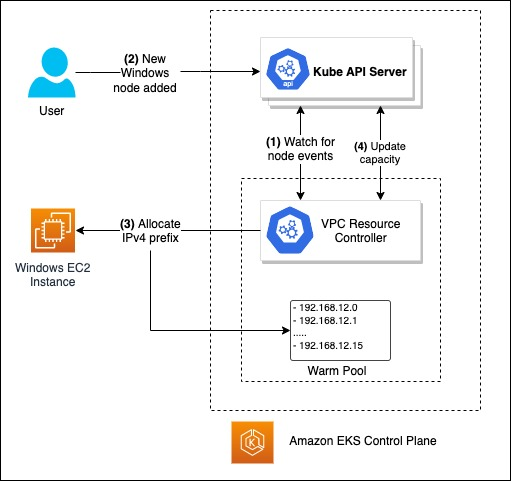
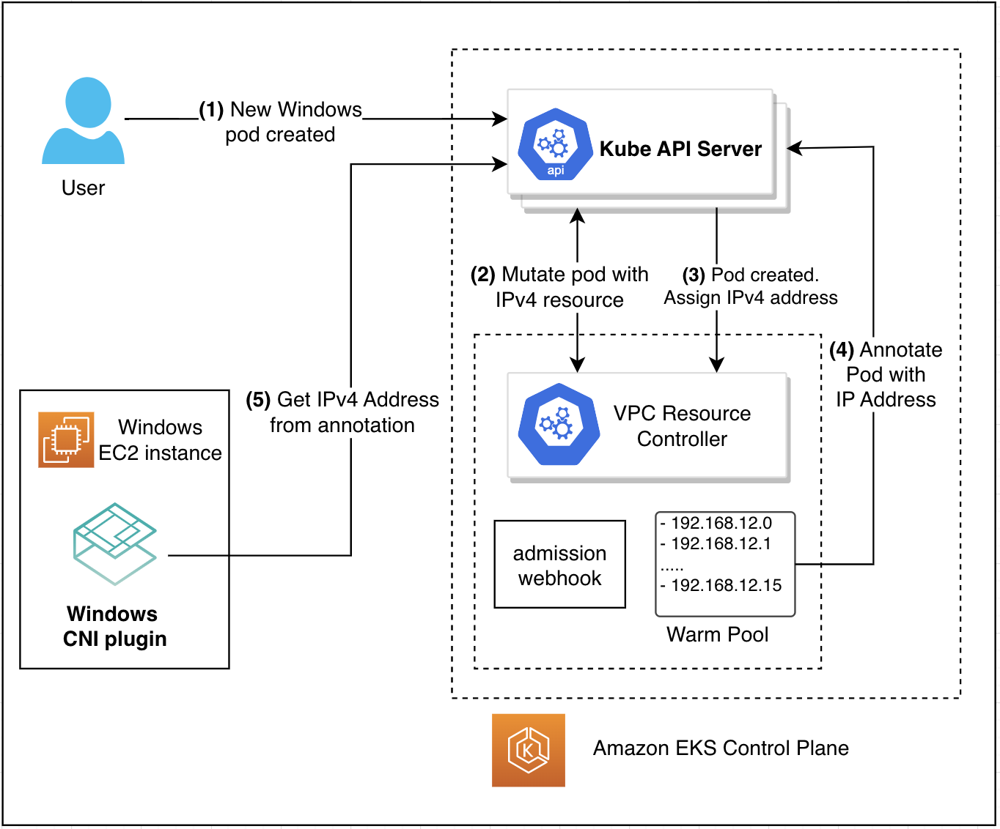

# Windows Event Workflows in IPv4 Prefix Delegation mode
This document presents high level workflow diagram for Events associated with Windows Nodes and Pods when using the IPv4 prefix delegation mode.

## Adding a Windows Node to the Cluster

1. Controller watches for Node Event from the Kube API server.
2. User Adds a Windows Node to the Cluster with the label `kubernetes.io/os: windows`.
3. Resource controller would start managing an IP address warm pool for the Windows node. It would invoke EC2 APIs on behalf of the customer to allocate /28 prefixes to the primary ENI. Internally, it would deconstruct the prefix into IP addresses and the pods would later be assigned one of the IP address from the prefix range. 
  
   In order to reduce latency after pod creation, controller would warm up a prefix beforehand. Customer can control the pre-scaling/warm settings using configuration options as specified [here](prefix_delegation_config_options.md).
4. Controller updates the resource capacity on this node to `vpc.amazonaws.com/PrivateIPv4Address: # (Secondary IP per interface -1)*16`. This limits the Number of Windows Pod that can be scheduled on Windows Node based on the number of available IPv4 addresses.

## Creating a new Windows Pod

1. User Creates a new Windows Pod with the nodeSelector `kubernetes.io/os: windows`.
2. Webhook mutates the Create Pod request by adding the following resource limit and capacity `vpc.amazonaws.com/PrivateIPv4Address: 1`. This tells the scheduler that the Pod has to be scheduled on a Node with 1 available IPv4 Address.
3. Controller receives the Pod Create event and allocates a IPv4 address from the Prefix Warm Pool. The IP address assigned to the pod would be from the range of one of the prefixes assigned to the primary ENI on the node.

   It is worthwhile to note that the controller would assign the IP address to the pods such that the prefix with the fewest remaining IP addresses would be consumed first. This means that if there are 2 prefixes on the node such that 10 IP addresses from the second prefix are yet to be allocated and 5 from the first, then newer pods will be allocated the IP addresses from the first prefix while it has unassigned IP addresses.

4. Controller annotates the Pod with `vpc.amazonaws.com/PrivateIPv4Address: IPv4 Address`.
5. VPC CNI Plugin Binary on the Windows host reads the IPv4 address present in the annotation from API Server and sets up the Networking for the Pod

## Delete events

When the pods are terminated, the IP addresses are released back into the warmpool. If the available IP addresses in the warmpool are greater than the required number, then controller will release the free prefixes. This essentially means that a prefix is released back only if all the IP addresses from its range are unallocated from the pods.