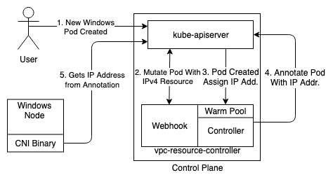

# Windows Event Workflows in Secondary IPv4 address mode
This document presents high level workflow diagram for Events associated with Windows Nodes and Pods when using the secondary IPv4 address mode.

## Adding a Windows Node to the Cluster

1. Controller watches for Node Event from the kube-apiserver.
2. User Adds a Windows Node to the Cluster with the label `kubernetes.io/os: windows`. 
3. Controller starts managing a Warm Pool for this Node. It maintains a pool of secondary IPv4 Address in this pool by using EC2 API on behalf of the user.
4. Controller updates the resource capacity on this node to `vpc.amazonaws.com/PrivateIPv4Address: # Secondary IP on single ENI`. This limits the Number of Windows Pod that can be scheduled on Windows Node based on the number of available IPv4 addresses.  

## Creating a new Windows Pod

1. User Creates a new Windows Pod with the nodeSelector `kubernetes.io/os: windows`.
2. Webhook mutates the Create Pod request by adding the following resource limit and capacity `vpc.amazonaws.com/PrivateIPv4Address: 1`. This tells the scheduler that the Pod has to be scheduled on a Node with 1 available Secondary IPv4 Address.
3. Controller receives the Pod Create event and allocates a Secondary IPv4 address from the Warm Pool. 
4. Controller annotates the Pod with `vpc.amazonaws.com/PrivateIPv4Address: IPv4 Address`.
5. VPC CNI Plugin Binary on the Windows host reads the IPv4 address present in the annotation from API Server and sets up the Networking for the Pod

For Delete Events the resource is added back to the Warm Pool and the controller maintains the warm pool size to a fixed count.
